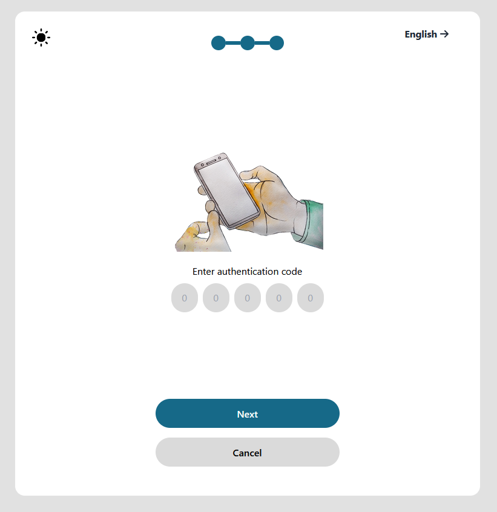
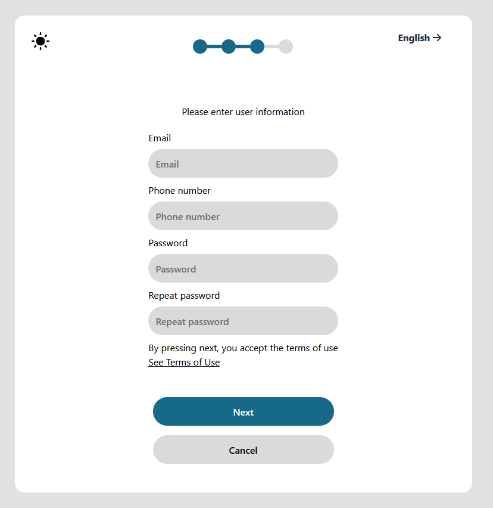
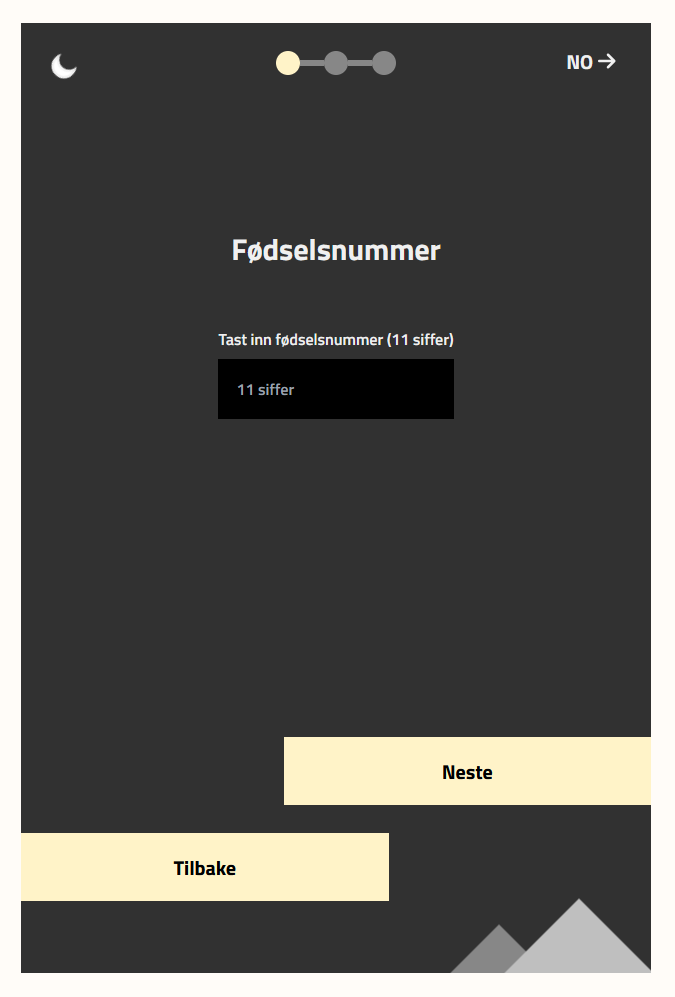
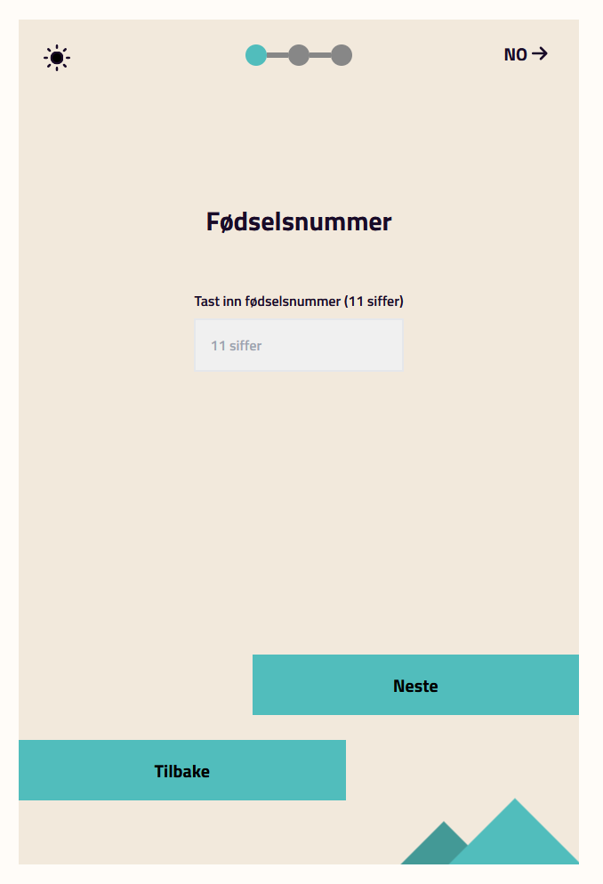

# MinID Login Page - Optimized Flow
## Summary
The MinID Login Page project offers an optimized login experience, implementing three different designs to enhance user interaction. It utilizes the Tailwind CSS framework and is bootstrapped with Create React App. The project caters to various users by supporting multiple languages and is structured in a way that encourages a smooth user experience while keeping security in focus. Detailed instructions are provided for setup, usage, and troubleshooting.

## Target Audience
The design aims to be as user-friendly as possible, requiring no prior knowledge of MinID. It supports multiple languages, making it suitable for non-native speakers. Basic understanding of computers is recommended for setting up the project.

## Table of Contents
1. [Summary](#summary)
2. [Target Audience](#target-audience)
3. [Table of Contents](#table-of-contents)
4. [Project File Architecture](#project-file-architecture)
5. [Scripts and dependencies](#scripts-and-dependencies)
   - [React Web Applications](#react-web-applications)
      - [Main Dependencies](#main-dependencies)
      - [Development Dependencies](#development-dependencies)
      - [Scripts](#scripts)
      - [Others](#others)
   - [React Native Expo Mobile Application: "authenticator"](#react-native-expo-mobile-application-"authenticator")
      - [Main Dependencies](#main-dependencies-1)
      - [Development Dependencies](#development-dependencies-1)
      - [Scripts](#scripts-1)
6. [Setup](#setup)
   - [Setup React Apps](#setup-react-apps)
   - [Setup Mobile Authenticator](#setup-mobile-authenticator)
7. [User Manual](#user-manual)
   - [Login Flow](#login-flow)
   - [Implementation 1](#implementation-1)
   - [Implementation 2](#implementation-2)
   - [Implementation 3](#implementation-3)
8. [Troubleshooting](#troubleshooting)
   - [Error during npm install](#error-during-npm-install)
   - [Unable to Start Development Server](#unable-to-start-development-server)
9. [Learn More](#learn-more)


## Project File Architecture
In the project, you will find different implementations of the design organized into separate folders. The first implementation represents the original design, the second implementation showcases the optimized design, and the third implementation features the original design with a different color scheme and layout. Each design has its own root directory within the implementation folders. To run all the different designs within the project, npm is used to install the necessary dependencies and build the extension. Run npm install in all the folders to install the required dependencies. See the setup section below for more information.

Following is the file structures (in order) for implementation 1, 2, and 3.


## Scripts and dependencies
### React Web Applications:

#### Main Dependencies:
- **React & ReactDOM**: `^18.2.0` - The core libraries for building user interfaces.
- **React Router DOM**: `^6.14.0` - A collection of navigational components.
- **FontAwesome**: `^6.4.0` - Icons library.
- **i18next** & **react-i18next**: `^23.2.6` & `^13.0.1` respectively - Used for internationalization and language selection.
- **react-toggle-dark-mode**: `^1.1.1` - A package to manage dark mode toggling.

#### Development Dependencies:
- **Tailwind CSS**: `^3.3.2` - A utility-first CSS framework.

#### Scripts:
- `start`: Start the development server.
- `build`: Builds the production version of the app.
- `test`: Run the test suite.
- `eject`: Ejects the configuration and scripts from `react-scripts`.

#### Others:
- ESLint configuration for linting.
- Browserlist to control the browsers supported in development and production.

### React Native Expo Mobile Application: "authenticator"

#### Main Dependencies:
- **Expo SDK**: `~48.0.18` - A framework for building native apps.
- **React Navigation**: Various packages for handling navigation.
- **React Native Reanimated**: `^3.3.0` - Enhanced animations.
- **Expo Barcode Scanner**: `~12.3.2` - Scanning barcodes functionality.
- **React Native SVG**: `^13.10.0` - SVG rendering.

#### Development Dependencies:
- **TypeScript**: `^4.9.4` - Static type-checking along with the latest ECMAScript features.
- **Jest & Jest Expo**: `^29.2.1` & `~48.0.0` - Testing library.

#### Scripts:
- `start`: Start the development server.
- `android`, `ios`, `web`: Start the development server for specific platforms.
- `test`: Run the test suite.


## Setup React Apps

This project was bootstrapped with Create React App.

To set up the project, follow these steps:

1. **Open the root directory of the extension (implementation1, implementation2 or implementation3) in a terminal.**

2. **Run the following commands in the terminal:**
    ```sh
    npm install
    ```
    ```sh
    npm start
    ```
   
3. This will open the project in development mode in your browser, at localhost:3000. Hee you can see the preview of the given implementation, and navigate through the design. 

4. In order to shut down the project, press ctrl + c in the terminal

## Setup Mobile Authenticator

This project was created with React Native Using Expo

To set up the project, follow these steps:

1. **Go to the authenticator directory:**
   ```sh
   cd authenticator
   ```

2. **Install dependencies:**
   ```sh
   npm install
   ```

3. **Start the development server:**
   ```sh
   expo start
   ```
   
4. **Scan the QR code with the Expo Go app or run on an emulator.**
5. 
    For more details, refer to the [Expo documentation](https://docs.expo.dev/).

## User Manual
When you open the project in your browser, you will see the MinID login page. You can navigate through the different pages of the login process, depending on which implementation you are using. Below are previews of the different designs, including both normal and dark mode, along with explanations of the login process for each implementation.

### Login Flow
The login flow of implementation 1 and 3 is illustrated below:


* To reach the activationLetterFlow (the blue box in the flow chart), you need to enter any one number in the form collecting national identification numbers and then press the login button.
* To access the noLetterActivationLetterOrderedFlow (the green box in the flow chart), you need to enter any two numbers in the form collecting national identification numbers and then press the login button.
* To access the normal loginFlow, you must enter any 11 numbers in the form collecting national identification numbers and then press the login button.

The login flow of implementation 2 is illustrated below:


* The "use App" portion of the flow will either consist of QR-code or authentication code. This is dependent on what is implemented. For simplicity for the user it is preferred that only one of these is implemented. In the current iteration the user first gets presented with the QR-code page and then can move on to the authentication page. This is only for presentation purposes.

### Implementation 1

This design uses birth number first to make the login process easier for the user. However, this solution is not very secure because of the risk of sanitizing of national identification number, and therefore we do not recommend this implementation. 
The flow is very similar to the current solution, but a notable change is that the social security number and password fields have been separated to prevent the user getting overwhelmed.
Dark and normal mode:

 

Main login flow if the user has account and everything works as intended:

 


Activation letter flow if user dont have account:

 
 

### Implementation 2

This app has two versions of what is essentially the same flow. Both is displayed in the demo app and can be navigated by the top link for demo purposes. But for user simplicity there is an argument to made that only one of them should be available. This solution is highly advantageous as it strikes a balance between security and user-friendliness. Although the SMS login buttons remain available, they have been downsized to encourage mobile app usage. This approach not only reduces costs for the government but also enhances user security. The app will be linked to the user's national identification number, enabling swift login procedures. When the user opens the app, they have to unlock it by either biometrics or a 4 letter pin they created upon registration. The app then generates a 5 letter code to be entered in the login flow. Opening the mobile application is therefore essentially the first step of this flow; both for the QR- and activation-code solutions. It's worth noting that this code remains active for a specific duration, ensuring both robust security and expeditious login processes.

The rest of the flow (E.G. activation letter, SMS alternative and forgotten password) is similar to implementation 1.

Neither the Application nor the authenticator is implemented to communicate with each other in any way and this is just a mockup.

Version 1: Authentication code
The app then generates a 5 letter code to be entered in the login flow.

Version 2: QR-code
The login flow generates a QR code for the user to scan with their app.

Authentication code and QR-code presesentation:

 

Mobile authenticator:
These images show the code generator with a moving slide to display how long the code will last along with the qr scanner on the last image:

  

### Implementation 3

This design has the same flow as implementation1, but with a different color scheme and layout.

Dark and normal mode:

 


## Troubleshooting

### Error during npm install
If you encounter an error while running the npm install command, follow these steps to troubleshoot:

1. Verify that you have a stable internet connection. Poor connectivity can cause issues with package installation.
2. Delete the node_modules directory in your project's root folder. Then, rerun npm install to reinstall the dependencies.
3. Ensure that you have Node.js installed on your system. You can check this by running the command node -v in the terminal. If Node.js is not installed, download and install it from the official Node.js website.
4. Check if there is a package-lock.json file in your project's root directory. If present, delete the file and run npm install again.
5. If the error persists, try running npm cache clean --force to clear the npm cache, and then run npm install again.

### Unable to Start Development Server (npm start)
If you are unable to start the development server using the npm start command, follow these steps to troubleshoot:

1. Make sure you are in the correct directory of your React project in the terminal.
2. Verify that all the necessary dependencies are installed by running npm install before starting the development server.
3. Check if there are any errors or warnings displayed in the terminal when attempting to start the server. Read the error message carefully to identify the issue.
4. Ensure that the port specified (usually 3000) by the development server is not already in use by another process. Try stopping any other applications that might be occupying the port and then rerun npm start.
5. If you have any antivirus or firewall software, temporarily disable it to check if it is blocking the development server.
6. Update your Node.js and npm versions to the latest stable releases. Use the commands npm install -g npm and npm install -g n to update npm and Node.js versions, respectively.
7. If the issue persists, try deleting the node_modules directory and reinstalling the dependencies using npm install.

If you continue to encounter problems with setting up the React environment or running the npm commands, refer to the official React documentation or seek support from the React community for more specific assistance. 

## Learn More

To learn more about creating and configuring React applications, you can visit the following resources:

[Create React App documentation](https://facebook.github.io/create-react-app/docs/getting-started).

[React documentation](https://reactjs.org/).

Additional documentation and guides for React and Create React App can be found within the respective documentation sites.

